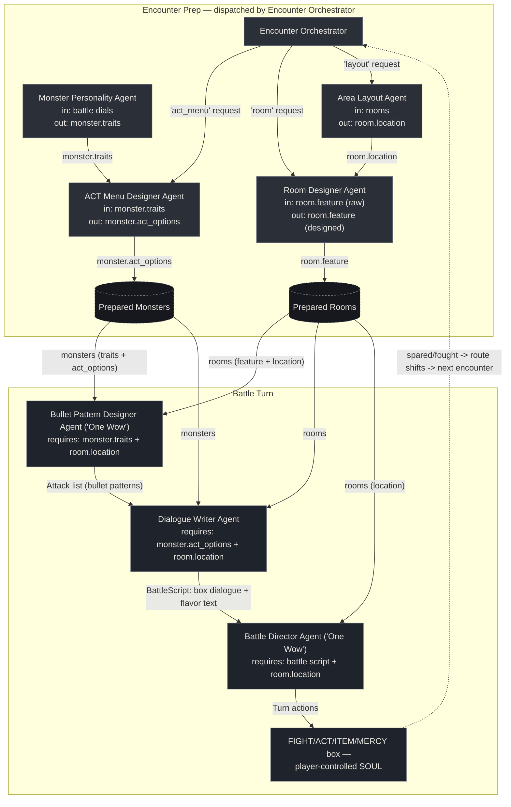

# Agent Diagram — Undertale Encounter Crew

One encounter state, one pipeline: an **Encounter Prep** stage (dispatched
by the Encounter Orchestrator, run once per new monster/room) feeds a
**Battle Turn** stage (run every time the player enters a fight). Every
arrow below is a real field being read/written in
[`agents.py`](agents.py) / [`crew.py`](crew.py) — none are decorative.

## Why every agent is load-bearing

Each arrow is enforced in code, not just implied — remove the upstream
agent and the downstream one raises a `ValueError` instead of silently
producing worse output:

- **Monster Personality Agent** writes `monster.traits`. Both **ACT Menu
  Designer Agent** and **Bullet Pattern Designer Agent** check for it and
  refuse to run without it.
- **Area Layout Agent** writes `room.location`. **Room Designer Agent**'s
  prompt uses it for placement context, and **Bullet Pattern Designer**,
  **Dialogue Writer**, and **Battle Director** all check for it directly
  and refuse to run without it.
- **ACT Menu Designer Agent** writes `monster.act_options`. **Dialogue
  Writer Agent** checks for it and refuses to run without it (it's quoted
  directly into the battle box's ACT line).
- **Room Designer Agent** overwrites `room.feature` with its designed
  spec — **Bullet Pattern Designer** and **Dialogue Writer** read that
  field, so a skipped Room Designer means they work off the raw seed
  hint instead of the designed environmental feature.
- **Bullet Pattern Designer Agent** is one of this crew's two "One Wow"
  agents: no attack list, no battle script, no turn actions — the battle
  turn returns empty immediately.
- **Dialogue Writer Agent** turns an attack into a battle script; **Battle
  Director Agent** (the other "One Wow" agent) raises if the script has
  no lines.
- **Encounter Orchestrator** is the single entry point the designer calls
  for new content — remove it and there's no dispatcher routing
  act_menu/room/layout requests to the right sub-agent.

You can reproduce this: comment out the personality pass or the prep pass
in `main.py` and re-run — the crew stops with a clear `ValueError` naming
exactly which upstream agent was skipped, rather than continuing with
silently degraded output.

## Reading the diagram

- **Solid arrows** are direct hand-offs where one agent's output is a
  required input to the next. **Dotted arrows** are the route/karma loop
  — Undertale tracks whether the player spares or fights, and that shifts
  the current route (Pacifist/Neutral/Genocide), which the Dialogue
  Writer Agent reads back in on the next encounter.
- **Prepared Monsters / Prepared Rooms** are the shared encounter state
  (not agents) — the fully-enriched objects that both the Encounter Prep
  and Battle Turn stages read and write.
