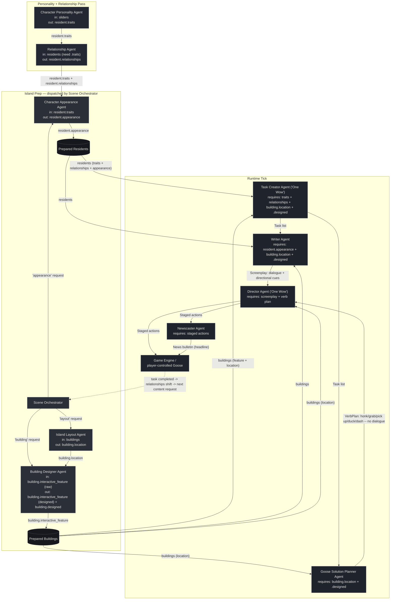

# Agent Diagram — Gachō Badi (Goose Buddy)

Eleven agents now, not eight. GDD Draft #3 added a **Relationship Agent**,
a **Goose Solution Planner Agent**, and a **Newscaster Agent** — borrowed
from this repo's Tomodachi Life and Untitled Goose Game reference crews
— after building those crews surfaced two gaps: nothing tracked how
residents felt about each other, and nothing guaranteed a task was
actually solvable with the goose's own moves. Three stages: a
**Personality + Relationship** pass, an **Island Prep** stage (dispatched
by the Scene Orchestrator), and a **Runtime Tick**. Every arrow below is
a real field being read/written in [`agents.py`](agents.py) /
[`crew.py`](crew.py) — none are decorative.

## Why every agent is load-bearing

Each arrow is enforced in code, not just implied — remove the upstream
agent and the downstream one raises a `ValueError` instead of silently
producing worse output:

- **Character Personality Agent** writes `resident.traits`. **Relationship
  Agent**, **Character Appearance Agent**, and **Task Creator Agent** all
  check for it and refuse to run without it.
- **Relationship Agent** writes `resident.relationships`. **Task Creator
  Agent** checks for it (whenever there's more than one resident) and
  refuses to run without it — a task about two residents who "drifted
  apart" needs an actual relationship on file, not a guess.
- **Island Layout Agent** writes `building.location`. **Building Designer
  Agent**'s prompt uses it for placement context, and **Task Creator**,
  **Writer**, **Goose Solution Planner**, and **Director** all check for
  it directly and refuse to run without it.
- **Character Appearance Agent** writes `resident.appearance`. **Writer
  Agent** checks for it and refuses to run without it (it's quoted
  directly into the screenplay's scene-setting line).
- **Building Designer Agent** overwrites `building.interactive_feature`
  with its designed spec and sets `building.designed = True`. **Task
  Creator**, **Writer**, and **Goose Solution Planner** all check
  `building.designed` and refuse to run without it, so a skipped Building
  Designer can't silently slip the raw seed text through as if it were
  finished content.
- **Task Creator Agent** is one of the GDD's two "One Wow" agents: no
  task list, no screenplay, no verb plan, no staged actions, no news
  bulletin — the runtime tick returns empty immediately.
- **Writer Agent** turns a task into a screenplay, and **Goose Solution
  Planner Agent** turns the same task into a verb-only plan (never
  dialogue, since the goose never speaks); **Director Agent** (the other
  "One Wow" agent) raises if either is empty — it needs both the script
  and the moves to stage a turn.
- **Director Agent**'s staged actions are what **Newscaster Agent**
  reports on — no staged actions, no headline, and it raises rather than
  filing an empty bulletin.
- **Scene Orchestrator** is the single entry point the programmer calls
  for new content — remove it and there's no dispatcher routing
  appearance/building/layout requests to the right sub-agent.

You can reproduce this: comment out the personality pass, the
relationship pass, or the dev-time pass in `main.py` and re-run — the
crew stops with a clear `ValueError` naming exactly which upstream agent
was skipped, rather than continuing with silently degraded output.

## Reading the diagram

- **Solid arrows** are direct hand-offs where one agent's output is a
  required input to the next. **Dotted arrows** are the community loop —
  a completed task shifts how residents feel about each other, which is
  what lets the player ask the Scene Orchestrator for the next resident
  or building.
- **Prepared Residents / Prepared Buildings** are the shared island state
  (not agents) — the fully-enriched objects that both the Island Prep and
  Runtime Tick stages read and write.
