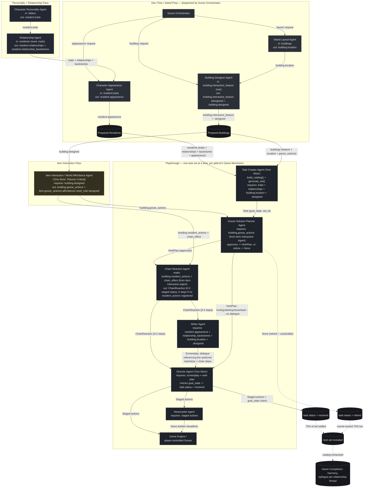

# Agent Diagram — Gachō Badi (Goose Buddy)

Thirteen agents now, matching gdd.txt's AI Architecture section exactly:
nine Runtime Gameplay Agents and four Dev-Time Content Pipeline agents.
An earlier version of this code stopped at eleven — it never implemented
the **Item Interaction / World Affordance Agent** the GDD has described
since Draft #8, so the Goose Solution Planner had nothing to validate
against and just invented actions from a fixed verb list. It's implemented
now (`agents/runtime/item_interaction_agent.py`), and its absence is
provably load-bearing, not just described that way — see below. Draft #11
adds a thirteenth agent, the **Chain Reaction Agent**
(`agents/runtime/chain_reaction_agent.py`): before it existed, a task's
gameplay stopped at the goose's own action and the target resident's
generic on-the-spot reaction — nothing staged the resident actually using
whatever the goose dropped, or a second resident being drawn in by that
use. Unlike the other additions, its absence degrades gracefully rather
than raising: a building/item with no registered `resident_actions`
(the common case) simply produces a zero-step chain, so most tasks are
unaffected either way.

Four stages: a **Personality + Relationship** pass, a **Dev-Time /
Island Prep** stage (dispatched by the Scene Orchestrator), an **Item
Interaction** pass, and a **Playthrough** that runs the actual task-set
loop from gdd.txt's Game Mechanics section — sets of 5-9 tasks, a 75%
threshold, retirement, an always-visible backlog, and Game Completion —
not one illustrative tick. Every arrow below is a real field being
read/written in [`agents/runtime/`](agents/runtime) /
[`agents/dev_time/`](agents/dev_time) / [`crew.py`](crew.py).

## Why every agent is load-bearing

Each arrow is enforced in code, not just implied — remove the upstream
agent and the downstream one raises a `ValueError`, or (for Item
Interaction specifically) every task in the run retires instead of
resolving:

- **Character Personality Agent** writes `resident.traits`. **Relationship
  Agent**, **Character Appearance Agent**, and **Task Creator Agent** all
  check for it and refuse to run without it.
- **Relationship Agent** writes `resident.relationships` AND
  `resident.relationship_backstories` (bidirectionally, for every pair in
  the roster — not just adjacent residents in a list, since the lifetime
  catalog references every ordered pair). **Task Creator Agent** checks
  for the label; **Writer Agent** checks for the backstory specifically
  and refuses to run without one — a label alone was ruled insufficient
  content for a task as of GDD Draft #9.
- **Island Layout Agent** writes `building.location`. **Building Designer
  Agent**'s prompt uses it for placement context, and **Task Creator**,
  **Writer**, and **Director** all check for it directly.
- **Building Designer Agent** overwrites `building.interactive_feature`
  and sets `building.designed = True`. **Item Interaction Agent** checks
  `building.designed` and refuses to register affordances without it —
  dev-time authors the feature; only then can runtime own its legal
  actions.
- **Item Interaction Agent** writes `building.goose_actions`. **Goose
  Solution Planner Agent** checks for it and, if absent, does not invent
  a fallback verb — it retires the task outright. This is provable, not
  just documented: skip this agent entirely and every single task in a
  run retires (verified directly — see the crew's own test:
  `crew.run_playthrough` with no `run_item_interaction_pass` call first
  produces `resolved=0, retired=<all>`).
- **Character Appearance Agent** writes `resident.appearance`. **Writer
  Agent** checks for it and refuses to run without it.
- **Task Creator Agent** is one of the GDD's two "One Wow" agents: no
  task set, nothing for the planner to approve or retire, nothing for the
  playthrough to settle.
- **Goose Solution Planner Agent** is the *other* half of "One Wow" the
  GDD calls out, and the actual gate the Task Creator's own candidates
  must clear: `run()` returns `None` instead of a `VerbPlan` when a
  building has no registered affordance, and `GachoBadiCrew._resolve_or_retire`
  retires the task on `None` rather than staging an invented solution —
  an earlier version of this crew skipped this gate entirely and handed
  the Task Creator's first candidate straight to staging.
- **Chain Reaction Agent** is the one addition that's deliberately *not*
  hard-fail: it reads `building.resident_actions` / `.chain_effect` (set
  by Item Interaction Agent) and, when the list is empty — the common
  case, since most affordances register no resident follow-up — returns a
  zero-step `ChainReaction` rather than raising. Only when a `chain_effect`
  AND the task's `other_resident` are both present does it stage the
  second, "drawn in" step; **Writer Agent** and **Director Agent** both
  accept `chain=None` and fall back to their pre-Draft-#11 generic beats,
  so removing this agent degrades content, not correctness.
- **Writer Agent** turns a task into a screenplay that references the
  Relationship Agent's specific backstory (and, when present, the Chain
  Reaction Agent's staged steps); **Director Agent** (the other "One Wow"
  agent) raises if the screenplay or verb plan is empty.
- **Director Agent** is the agent gdd.txt makes responsible for actually
  confirming a task: `check_goal_state` verifies the referenced
  resident(s) and building still exist before flipping `task.status` to
  `"resolved"` — it is not a stub that always returns `True` (verified
  directly against a task naming a resident/building outside the current
  cast, which correctly returns `False`).
- **Newscaster Agent** reports on the Director's staged actions — no
  staged actions, no headline, and it raises rather than filing an empty
  bulletin.
- **Scene Orchestrator** is the single entry point the programmer calls
  for new content — remove it and there's no dispatcher routing
  appearance/building/layout requests to the right sub-agent.

You can reproduce the ValueError chain: comment out the personality
pass, the relationship pass, or the dev-time pass in `main.py` and
re-run — the crew stops with a clear `ValueError` naming exactly which
upstream agent was skipped, rather than continuing with silently
degraded output.

## The Playthrough loop (`GachoBadiCrew.run_playthrough`)

This is the part an earlier version of this crew didn't have at all — it
ran one hardcoded tick and stopped. Now:

1. `build_catalog()` enumerates every `(resident, other, building)`
   premise slot the roster supports — the pre-authored lifetime catalog
   gdd.txt describes (~30-40 tasks at the full 6/6/6 roster; fewer at
   this demo's smaller seed, same code path).
2. `TaskCreatorAgent.generate_set()` slices the next 5-9 premises off
   that catalog and turns each into a `Task` with an explicit
   `goal_state` — it does not invent new premises.
3. Each task in the set is settled in order — planner-approved and
   resolved, or planner-retired — until 75% of the set (rounded up) has
   left `"open"` status. The rest of the set stays open on the
   always-visible backlog; nothing is hidden.
4. The next set is revealed from wherever the catalog left off. Repeat
   until the catalog is exhausted.
5. Every task still `"open"` on the backlog (from *any* set, not just
   the last one) is settled in a final mop-up pass — gdd.txt: the true
   ending needs *every* generated task to have left the active list, not
   just each set's 75% gate.
6. **Game Completion**: one authored epilogue line per relationship
   thread (deduplicated across that pair's several building-instances,
   not repeated once per task), differentiated by resolved vs. retired,
   then harmony is declared.

## Reading the diagram

- **Solid arrows** are direct hand-offs where one agent's output is a
  required input to the next. **Dotted arrows** are state transitions
  the playthrough loop drives (retirement, resolution, set advancement,
  completion), not agent-to-agent calls.
- **Prepared Residents / Prepared Buildings** are the shared island state
  (not agents) — the fully-enriched objects every later stage reads and
  writes.
