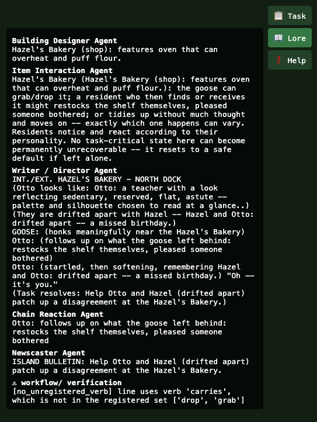
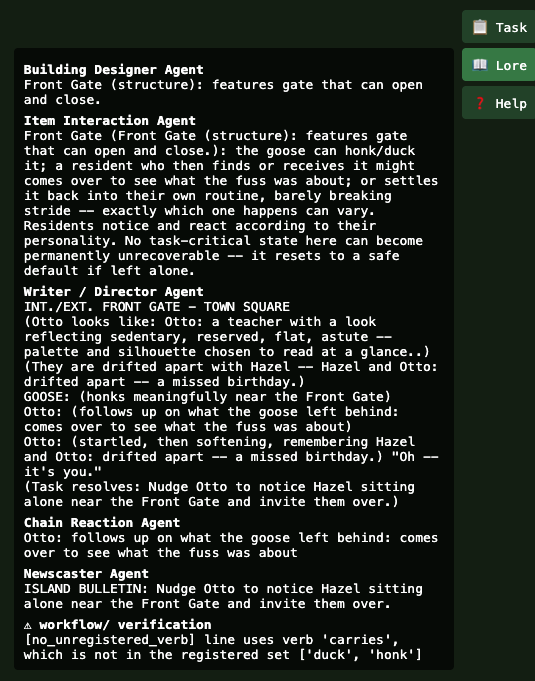
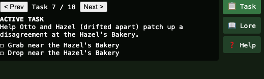
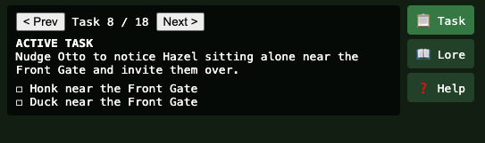
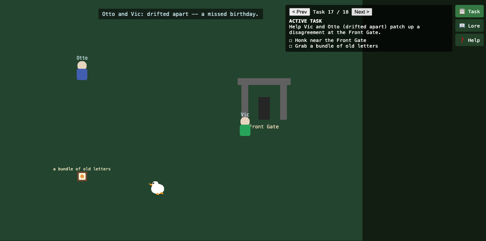
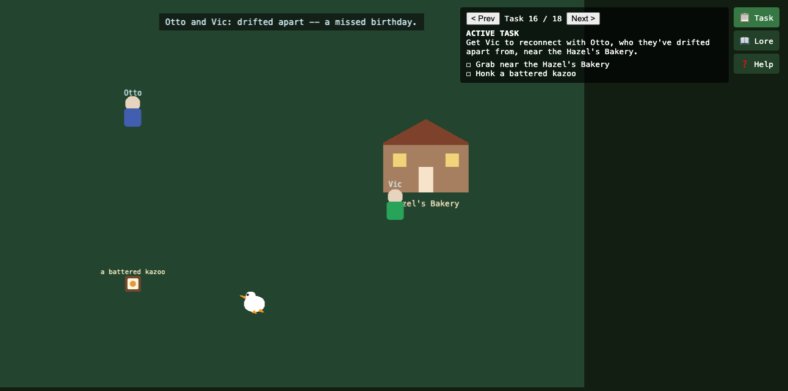

# Gachō Badi — Goal-Oriented Coding Agent (Assignment #5)

A goal-oriented coding agent that reads Gachō Badi's own GDD (`design_review/gdd.txt`), runs the game's existing codebase (`agents/runtime/`), detects where an agent's real output drifts from what the GDD requires of it, prioritizes which drift to fix first, and rewrites that agent's own configuration on disk until the drift is gone — or until it proves that no amount of retuning will help.

```bash
cd GachoBadi
python3 workflow/goal_oriented/run_goal.py --list
python3 workflow/goal_oriented/run_goal.py --agent chain_reaction
python3 workflow/goal_oriented/run_goal.py --agent task_creator
python3 workflow/goal_oriented/run_goal.py --agent goose_solution_planner \
    --forbidden-rules no_unregistered_verb --description "never invent a goose verb"
```

No API key required (deterministic mock LLM provider, see `api/llm_client.py`).

## How this maps to the assignment

| Requirement | Where it happens |
|---|---|
| **Read your GDD** | Every gap detector is traced back to a specific `design_review/gdd.txt` passage: the Technical Strategy table's per-agent token budgets, the Executive Summary's "quiet community-builder, not mischief for its own sake" pitch, the Item Interaction Agent's "no invented behavior" contract, and the Chain Reaction cap of two staged steps. |
| **Scan the codebase** | It runs the *actual* production code — `agents/runtime/goose_solution_planner_agent.py`, `task_creator_agent.py`, `chain_reaction_agent.py` — against a fixed fixture (`workflow/generic/demo_verify.py`'s `build_context()`), not a re-implementation or a mock of them. |
| **Detect gaps** | 12 gap detectors (4 per agent, in `workflow/constraints/<agent>/constraints.py`) diff each agent's real output against its GDD contract and return `Finding`s when they disagree. |
| **Prioritize** | `workflow/constraints/<agent>/constraints.yaml`'s `priority_weights` (copied straight from the GDD's own risk ranking) plus `--forbidden-rules` decide which unresolved finding gets tuned first — see `goal.py`'s `_pick_target_rule`. |
| **Generate code** | The outer loop (`workflow/goal_oriented/agent.py`) writes a real file back to disk: it edits that agent's `constraints.yaml` (bumping the priority weight and retry budget for the worst offending rule) and backs up the hand-authored original as `constraints.yaml.orig` the first time it ever touches a file. |

The missing feature this agent identified and built: **none of the three highest-risk agents the GDD's own Technical Strategy table calls out (Goose Solution Planner: "Highest" priority; Task Creator: "High") had any mechanical check that their LLM-authored output actually honored the rules the GDD states for them.** `agents/runtime/`, `crew.py`, and `main.py` are untouched by this work — the entire `workflow/` package is new code, added as a layer that wraps those three agents rather than rewriting them.

## The three agents it watches

| Agent | Runtime code | Constraint folder | What it enforces |
|---|---|---|---|
| **Goose Solution Planner** | `agents/runtime/goose_solution_planner_agent.py` | `workflow/constraints/goose_solution_planner/` | `no_unregistered_verb` (BLOCKING, weight 1000) — every `Goose: <verb>` line must use a verb the building actually registered; `no_dialogue_leak`, `has_at_least_one_verb_step` (BLOCKING); `mentions_task_context` (ADVISORY). |
| **Task Creator** | `agents/runtime/task_creator_agent.py` | `workflow/constraints/task_creator/` | `mentions_both_residents` (BLOCKING); `no_mischief_tone` (BLOCKING, weight 950) — bans "mischief/chaos/prank" language that would contradict the GDD's pitch; `mentions_building`, `not_too_short` (ADVISORY). |
| **Chain Reaction** | `agents/runtime/chain_reaction_agent.py` | `workflow/constraints/chain_reaction/` | `outcome_is_registered` (BLOCKING, weight 1000) — the staged follow-up must match one of the building/item's registered `possible_outcomes` verbatim; `chain_effect_requires_other_resident`, `max_two_steps`, `step_actor_is_task_participant` (BLOCKING). |

Each folder holds the same two files: `constraints.yaml` (declarative — token budget, priority weights, `max_retries`, straight out of the GDD) and `constraints.py` (the actual gap-detection logic — regex verb extraction, tone-word scanning, outcome matching). Full design rationale for that split is in `workflow/README.md`.

## Where the outputs land

- **Per-attempt log (inner loop — every `generate()` call, pass or fail):** `workflow/logs/changelog.jsonl`
- **Per-cycle log (outer, goal-oriented loop — what was unresolved, what got tuned, why):** `workflow/logs/goal_log.jsonl`
- **Tuned constraints, written back to disk mid-run:** `workflow/constraints/<agent>/constraints.yaml`, with the hand-authored original preserved once as `constraints.yaml.orig`
- **The actual game's generated content** (unrelated file, downstream of these same three agents once the crew runs for real): `output/crew/`, one file per generated piece, indexed by `output/crew/manifest.json`

## Real runs, real findings

```
$ python3 workflow/goal_oriented/run_goal.py --agent task_creator
[Task Creator Agent] generated set #1: 1 task(s) (catalog offset 0)
  generated task: "Get Hazel to reconnect with Otto, who they've drifted apart from, near the Hazel's Bakery."
[cycle 1] unresolved: (none) -- GOAL MET
achieved=True  stopped_reason='goal_met'  cycles_run=1
```

```
$ python3 workflow/goal_oriented/run_goal.py --agent chain_reaction
[Chain Reaction Agent] task #1: rolled outcome 'just resets it where it belongs with a shrug' -> staged 1-step chain
[cycle 1] unresolved: (none) -- GOAL MET
achieved=True  stopped_reason='goal_met'  cycles_run=1
```

```
$ python3 workflow/goal_oriented/run_goal.py --agent goose_solution_planner \
    --forbidden-rules no_unregistered_verb --description "never invent a goose verb"
[cycle 1] unresolved: ['no_unregistered_verb'] -- not yet
  adjusted: priority_weights['no_unregistered_verb']: 1000 -> 1200; max_retries: 2 -> 3
[cycle 2] unresolved: ['no_unregistered_verb'] -- not yet
achieved=False  stopped_reason='stagnant'  cycles_run=2
  Constraint tuning stalled: the same findings survived an adjustment unchanged -- likely a deterministic
  agent/mock-provider ceiling this loop cannot retune past.
```

Task Creator and Chain Reaction pass clean immediately. Goose Solution Planner is the interesting case: it stalls on purpose, and correctly. Its fallback text always includes `Goose: carries it toward {resident}.`, and `"carries"` is never one of a building's registered verbs. The agent bumps the rule's priority and retry budget once, reruns, sees the *identical* unresolved finding, and stops rather than burning the rest of its cycle budget — because with the mock LLM provider (no API key configured), retry feedback has nothing to influence: the fallback string is returned verbatim regardless of what the prompt says. That's a real ceiling, not a bug in the loop, and the agent is built to recognize and report it rather than pretend the next cycle will help.

## Were you able to run this in your game? Yes — and you can see it happen

This isn't a side experiment sitting next to the game; `executable/crew.py` already wraps the same three agents in this exact machinery (`GuardedLLMClient` for Goose Solution Planner and Task Creator, `verify_output()` for Chain Reaction) for every real playthrough `python3 executable/main.py` runs. Because `constraints.yaml` is read fresh at the start of each process, any tuning the goal-oriented agent writes to disk is picked up automatically the next time the game runs — no code change, no redeploy.

Running the real game (`python3 executable/main.py`) reproduces the exact same finding the goal-oriented loop surfaced above, live across a full 18-task playthrough:

```
[Goose Solution Planner Agent][VERIFY] task #9 unresolved: [no_unregistered_verb] line uses verb 'carries',
  which is not in the registered set ['dash', 'drop', 'grab']
...
--- verification: 18 unresolved finding(s) across 18 task(s); full attempt log at workflow/logs/changelog.jsonl ---
```

And it isn't just console text — it's visible in the Phaser client itself. The Lore panel renders each scene's full agent trail, including a `⚠ workflow/ verification` section showing the exact same `no_unregistered_verb` finding, per building, as it happens:



*Fig 1. The Lore panel for Hazel's Bakery, showing every agent's contribution to the scene (Building Designer, Item Interaction, Writer/Director, Chain Reaction, Newscaster) followed by the `⚠ workflow/ verification` block — the same `no_unregistered_verb` finding for the invented verb `'carries'` that the goal-oriented agent surfaces standalone, now caught live during real play.*



*Fig 2. The same verification block firing again for a second building, Front Gate — confirming the finding isn't a one-off fixture artifact but a real, repeatable gap in the Goose Solution Planner's fallback text across every building in the game.*

The task panel itself improved over the course of this work, too — an example of the kind of gap this same verification mindset (see `workflow/README.md`'s note on redundant step targets) was built to catch:



*Fig 3. An earlier task panel at Hazel's Bakery: both verb steps read "near the Hazel's Bakery," a copy-paste target with only the verb swapped in.*



*Fig 4. The same generic-target pattern at the Front Gate — "near the Front Gate" twice, with nothing distinguishing one step's target from the other's.*



*Fig 5. The fixed version: each step now names a specific target — "Grab a bundle of old letters" instead of a repeated building name — shown live in the Phaser scene with the goose and both residents in place.*



*Fig 6. The same fix at a second building and task: "Honk a battered kazoo" replaces the old generic "near the Hazel's Bakery" phrasing.*

## Bonus: playing it in Phaser

`web/index.html` + `web/game.js` turn `output/crew/`'s JSON into a scene. Serve from `GachoBadi/` itself (not from inside `web/`, which 404s the live fetch):

```bash
cd GachoBadi && python3 -m http.server 8000
# open http://localhost:8000/web/index.html
```

Move with WASD/arrows; verbs are Honk (Space), Grab (E), Pick up (R), Duck (Q), Dash (Shift). The **Task** panel shows which verbs the plan still needs; the **Lore** panel shows the full per-scene agent trail plus the workflow verification block from Figs 1–2 above.

## Further reading

`workflow/README.md` is the deep design document for the whole `workflow/` package — the inner guardrail/retry loop, the YAML/Python constraint split and why, and the goal-oriented outer loop's own stagnation-detection logic in full.
