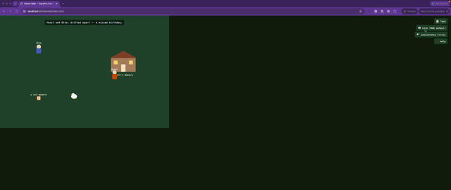

# Gachō Badi — Dynamic Content Pipeline (Assignment #4)



*RAG output uses three agents (Item Interaction, Relationship Backstory,
and Task Premise) to contribute to the developing lore and tasks; the
tasks themselves are primitive and lack cause and effect. There is a
lack of continuity that the Consistency Critic Agent misses.*

A RAG pipeline that reads Gachō Badi's own GDD (`gdd.txt`) and generates
three content types the game specifically needs, each checked by a
Consistency Critic Agent before it's accepted. Separate from the AI
Architecture crew in this folder (`agents/runtime/`, `agents/dev_time/`,
`crew.py`, `main.py` — Assignment #3, untouched by this work).

```bash
cd GachoBadi
python3 run_content_pipeline.py
```

No API key required (deterministic fallback, see `llm_client.py`).

## Output files

Every generated piece gets its own file — nothing is bundled into one
big JSON. A run writes this:

```
output/content_pipeline/
├── manifest.json                                    <- index: game, allowed_verbs, which files exist and in what order
├── 01_item_affordance_a-lost-memento.json            <- Item Interaction Content Agent
├── 02_relationship_backstory_hazel-otto.json         <- Relationship Backstory Content Agent
├── 03_task_premise_mend-fallout.json                 <- Task Premise Content Agent (Hazel/Otto)
├── 04_item_affordance_a-chipped-garden-trowel.json   <- Item Interaction Content Agent, 2nd item
├── 05_task_premise_welcome-isolated.json             <- Task Premise Content Agent, 2nd task (Vic/Hazel)
└── catalog_check.json                                <- cross-task redundancy check over 03 + 05
```

Filenames are self-describing on their own: `{order}_{content_type}_{detail}.json`,
where `{detail}` is the item name, the resident pair, or the connection
kind — so which file is which is legible without opening any of them.
Re-running `python3 run_content_pipeline.py` clears this directory first,
so it never accumulates stale files from a previous run.

**`manifest.json`** — what a client (the Phaser page in `web/`, or a
grader) reads first:
```json
{
  "game": "Gacho Badi (Goose Buddy)",
  "allowed_verbs": ["Dash", "Duck", "Grab", "Honk", "Pick up"],
  "records": [
    { "content_type": "item_affordance", "file": "01_item_affordance_a-lost-memento.json" },
    { "content_type": "relationship_backstory", "file": "02_relationship_backstory_hazel-otto.json" },
    { "content_type": "task_premise", "file": "03_task_premise_mend-fallout.json" },
    { "content_type": "item_affordance", "file": "04_item_affordance_a-chipped-garden-trowel.json" },
    { "content_type": "task_premise", "file": "05_task_premise_welcome-isolated.json" }
  ],
  "catalog_check_file": "catalog_check.json"
}
```

**Every numbered file** (`01`–`05`) has the same shape — the full RAG +
critic audit trail for that one generated piece:

| Field | What it holds |
|---|---|
| `content_type` | `item_affordance` \| `relationship_backstory` \| `task_premise` |
| `query` | the exact RAG query string sent to `rag.py` |
| `retrieved` | the chunk(s) it pulled back from `gdd.txt` — `chunk_id`, `heading`, `text`, TF-IDF `score` |
| `raw_output` | what the content agent generated, before the critic touched it |
| `passed_critic` | `false` if the critic changed anything |
| `critic_violations` | list of specific issues caught (empty if none) |
| `critic_commentary` | the critic's one-line verdict |
| `final_output` | the corrected text — what the game/Phaser client actually uses |
| `meta` | structured fields (`item_name`, `resident`/`other`, `building`, `connection_kind`, etc.) so a client doesn't have to re-parse `final_output`'s prose |

**`catalog_check.json`** — the batch-level check across every task file
(not per-file, since redundancy across *different* tasks can't be seen
by checking one task at a time):
```json
{
  "checked_tasks": ["mend_fallout", "welcome_isolated"],
  "violations": []
}
```

## Game-Anchored Source

Knowledge base = `gdd.txt` itself, Draft #10 (no placeholder lore).
`rag.py` splits it into paragraph-level chunks (83 as of this GDD draft)
and retrieves with plain TF-IDF — no embeddings, no third-party
dependency.

## Content Fit — what was generated, and why the game needs it

| Content type | Fills this gap |
|---|---|
| **Item affordance spec** (a memento) | GDD describes an Item Interaction Agent (Draft #8+); `agents/runtime/` never implements one. |
| **Relationship backstory** (Hazel/Otto, "drifted apart") | `RelationshipAgent` only assigns a label; Draft #9 made the one-line authored "why" mandatory, and nothing generates it. |
| **Task premise + verb plan** (mend a falling-out at Hazel's Bakery) | Draft #10 says the ~30-40 task premises are pre-authored content; the runtime `TaskCreatorAgent` only round-robins 5 generic templates. |

Three of the four pipeline agents (`agents/dynamic_content/`) are
adapted from `UntitledGooseGame_Multi_Agent`'s agents, each pointed at
one of these gaps. The fourth, the Consistency Critic Agent, exists
because that borrowing risks leaking UGG's own verbs/tone in — see below.

## RAG Implementation — query, retrieved chunk, output

**Query:** `"item interaction affordance memento goose actions reset rule no permanent loss"`
**Retrieved chunk #14:** `"How items participate in tasks: every interactive object has an explicit affordance record maintained by the Item Interaction Agent..."`
**Output:** `"a lost memento (memento): identifies an owner and a shared-memory association; the goose can grab/carry/drop/hide it; ...it drifts back to its owner or origin building if left obscure..."`

**Query:** `"relationship agent authored backstory drifted apart why not just a label flip"`
**Retrieved chunk #53:** `"...a short one-line backstory for how that state came to be (e.g. 'drifted apart after a mixed-up mail delivery')..."`
**Output:** `"Hazel and Otto: drifted apart -- a missed birthday."`

**Query:** `"tasks are actions goose must perform on residents or buildings open-ended indirect interaction"`
**Retrieved chunk #13:** `"Tasks are actions that the goose must perform on residents or buildings, framed around bringing residents together rather than causing them trouble..."`
**Output (before critic):**
```
Help Hazel and Otto patch up a disagreement at the Hazel's Bakery.
Goose: Grab a lost memento, the same one Hazel and Otto argued over.
Goose: Run it straight between them before either one can walk off.
Goose: Honk until neither of them can keep pretending not to notice.
Otto: goes quiet, then laughs -- the argument was never really about a lost memento
```
(Full, un-truncated triples for all five records under `output/content_pipeline/` — one file each.)

## Consistency Checking — what the Critic actually caught

The task premise above used **"Run"** — Untitled Goose Game's verb, left
in `CONNECTION_KINDS["mend_fallout"]`
(`agents/dynamic_content/task_premise_content_agent.py`) when that table
was adapted from UGG's `ChecklistCreatorAgent` without updating its verb
list. Gachō Badi's five verbs are Honk/Grab/Pick up/Duck/Dash — "Run"
isn't one of them. Left in on purpose so this catch is real, not staged:

```
[Consistency Critic Agent] caught 1 issue(s) in task_premise:
  - used goose verb 'Run', which is not one of Gacho Badi's five verbs
    (Dash, Duck, Grab, Honk, Pick up) -- consistent with it being carried
    over while adapting an Untitled Goose Game agent; replaced with 'Dash'.
corrected -> Help Hazel and Otto patch up a disagreement at the Hazel's Bakery.
Goose: Grab a lost memento, the same one Hazel and Otto argued over.
Goose: Dash it straight between them before either one can walk off.
Goose: Honk until neither of them can keep pretending not to notice.
Otto: goes quiet, then laughs -- the argument was never really about a lost memento
```

Two more checks exist for the same reason but didn't fire this run
(nothing tripped them, verified separately rather than just claimed):

- **Banned tone words** ("mischief," "chaos," "prank" → "connection,"
  "harmony," "gesture") — Gachō Badi is "quiet community-builder," never
  mischief-for-its-own-sake.
- **Redundant step targets** — earlier revisions of every
  `CONNECTION_KINDS` template had every goose-verb step target the same
  generic `"near the {building}"` phrase, so a plan like
  `Grab near the bakery. / Dash near the bakery. / Honk near the bakery.`
  read as a copy-paste with only the verb swapped. `ConsistencyCriticAgent._find_redundant_step_targets`
  catches this (detection-only — a redundant target has no single
  mechanical substitution, so the real fix is `TaskPremiseContentAgent`
  authoring a distinct target per step, which is why every step above now
  names the item, the other resident, or a specific detail instead of the
  building three times).
- **Catalog-level redundancy** (`ConsistencyCriticAgent.check_catalog_redundancy`)
  — a single-task check can't see that two *different*, individually
  fine tasks still reuse the same item or run the identical verb
  sequence, which would make even bug-free tasks feel copy-pasted once
  read as a catalog (Draft #10's ~30-40-task catalog, specifically). The
  pipeline generates a second task (a different item, a different
  connection kind, a different pair) specifically so this has more than
  one task to compare: `{"checked_tasks": ["mend_fallout", "welcome_isolated"], "violations": []}`.

## Voice Judgment

**Does it sound like Gachō Badi, not UGG or generic content?** Yes, once
corrected — the item affordance and relationship backstory were in-voice
on the first pass; the task premise needed the critic's fix above to
stop importing UGG's verb.

**Concrete retrieval tweak:** the task-premise query originally read
`"task creator connection goose verbs honk grab pick up duck dash no
dialogue"`, which retrieved the roster/scoping paragraph instead of the
GDD's actual task-definition sentence. Rewriting it to echo the GDD's own
wording (`"tasks are actions goose must perform on residents or
buildings open-ended indirect interaction"`) pulled chunk #13 in instead
— the version now in `content_pipeline.py` (see the comment at the call
site for the before/after).

## Bonus: playing it in Phaser

`web/index.html` + `web/game.js` turn the same JSON into a scene (same
pattern as `UntitledGooseGame_Multi_Agent/web`). Serve from `GachoBadi/`
itself (not from inside `web/`, which 404s the live fetch):

```bash
cd GachoBadi && python3 -m http.server 8000
# open http://localhost:8000/web/index.html
```

Move with WASD/arrows; verbs are Honk (Space), Grab (E), Pick up (R),
Duck (Q), Dash (Shift). The **Task** panel shows which verbs the plan
still needs; the **Consistency Critic** panel shows the same pass/fail
verdicts as above, in-game.
