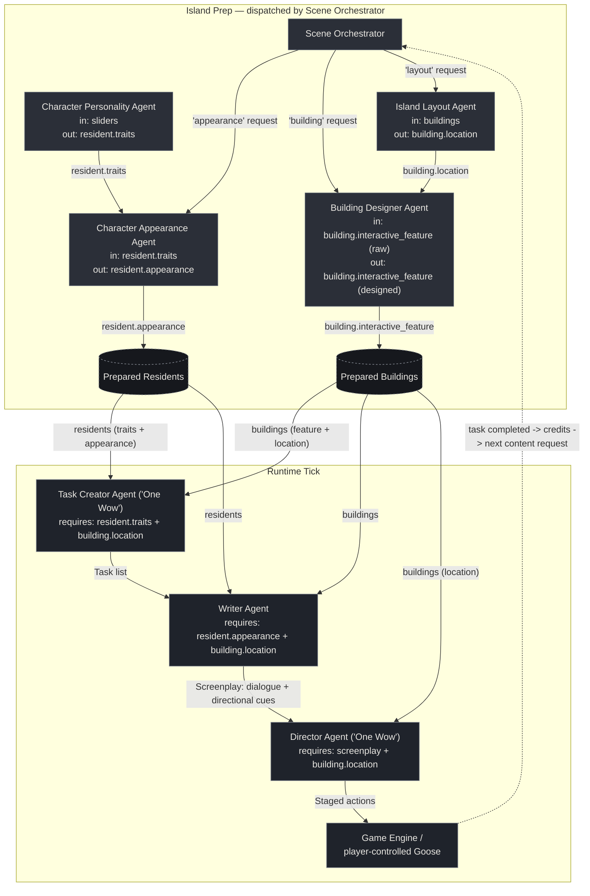

# Agent Diagram — Gachō Badi (Goose Buddy)

One island state, one pipeline: an **Island Prep** stage (dispatched by the
Scene Orchestrator, run per new resident/building) feeds a **Runtime Tick**
stage (run every time the player triggers a task). Every arrow below is a
real field being read/written in [`agents.py`](agents.py) / [`crew.py`](crew.py)
— none are decorative.

## Why every agent is load-bearing

Each arrow is enforced in code, not just implied — remove the upstream
agent and the downstream one raises a `ValueError` instead of silently
producing worse output:

- **Character Personality Agent** writes `resident.traits`. Both
  **Character Appearance Agent** and **Task Creator Agent** check for it
  and refuse to run without it.
- **Island Layout Agent** writes `building.location`. **Building Designer
  Agent**'s prompt uses it for placement context, and **Task Creator**,
  **Writer**, and **Director** all check for it directly and refuse to
  run without it.
- **Character Appearance Agent** writes `resident.appearance`. **Writer
  Agent** checks for it and refuses to run without it (it's quoted
  directly into the screenplay's scene-setting line).
- **Building Designer Agent** overwrites `building.interactive_feature`
  with its designed spec — **Task Creator** and **Writer** read that
  field, so a skipped Building Designer means they work off the raw seed
  hint instead of the designed feature.
- **Task Creator Agent** is one of the GDD's two "One Wow" agents: no
  task list, no screenplay, no staged actions — the runtime tick returns
  empty immediately.
- **Writer Agent** turns a task into a screenplay; **Director Agent**
  (the other "One Wow" agent) raises if the screenplay has no lines.
- **Scene Orchestrator** is the single entry point the programmer calls
  for new content — remove it and there's no dispatcher routing
  appearance/building/layout requests to the right sub-agent.

You can reproduce this: comment out the personality pass or the layout
pass in `main.py` and re-run — the crew stops with a clear `ValueError`
naming exactly which upstream agent was skipped, rather than continuing
with silently degraded output.

## Reading the diagram

- **Solid arrows** are direct hand-offs where one agent's output is a
  required input to the next. **Dotted arrows** are the credit loop —
  a completed task earns credits, which is what lets the player ask the
  Scene Orchestrator for the next resident or building.
- **Prepared Residents / Prepared Buildings** are the shared island state
  (not agents) — the fully-enriched objects that both the Island Prep and
  Runtime Tick stages read and write.
