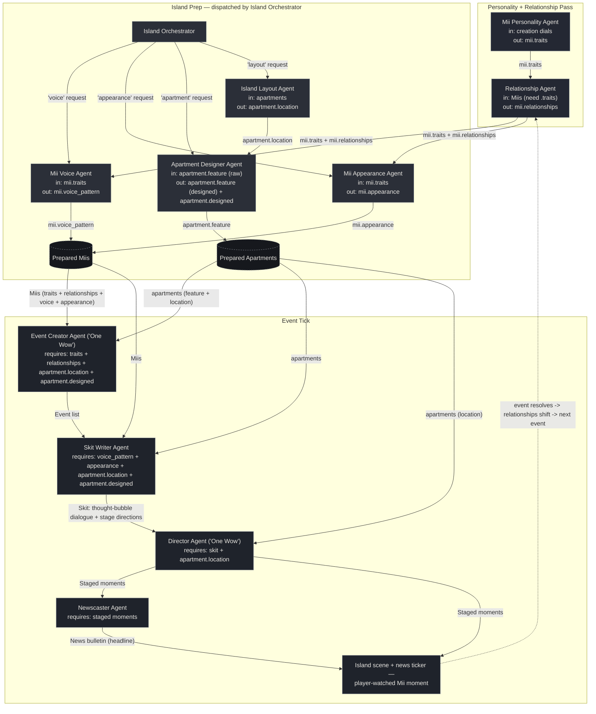

# Agent Diagram — Tomodachi Life Island Crew

Eleven agents, not a re-skin of any other crew's role count. Tomodachi
Life's own identity is its relationship web, its synthesized Mii voices,
and its nightly news recap — none of which exist in Gacho Badi's GDD
template, so this crew has dedicated agents for them. Three stages: an
**Personality/Relationship** pass, an **Island Prep** stage (dispatched
by the Island Orchestrator), and an **Event Tick** stage. Every arrow
below is a real field being read/written in [`agents.py`](agents.py) /
[`crew.py`](crew.py) — none are decorative.

## Why every agent is load-bearing

Each arrow is enforced in code, not just implied — remove the upstream
agent and the downstream one raises a `ValueError` instead of silently
producing worse output:

- **Mii Personality Agent** writes `mii.traits`. **Relationship Agent**,
  **Mii Voice Agent**, **Mii Appearance Agent**, and **Event Creator
  Agent** all check for it and refuse to run without it.
- **Relationship Agent** writes `mii.relationships`. **Event Creator
  Agent** checks for it (whenever there's more than one Mii) and refuses
  to run without it — an event about "friendly rivals" needs an actual
  relationship on file, not a guess.
- **Island Layout Agent** writes `apartment.location`. **Apartment
  Designer Agent**'s prompt uses it for placement context, and **Event
  Creator**, **Skit Writer**, and **Director** all check for it directly
  and refuse to run without it.
- **Mii Voice Agent** writes `mii.voice_pattern`, and **Mii Appearance
  Agent** writes `mii.appearance`. **Skit Writer Agent** checks for both
  and refuses to run without them (both are quoted directly into the
  skit's scene-setting lines).
- **Apartment Designer Agent** overwrites `apartment.feature` with its
  designed spec and sets `apartment.designed = True`. **Event Creator**
  and **Skit Writer** both check `apartment.designed` and refuse to run
  without it, so a skipped Apartment Designer can't silently slip the raw
  seed text through as if it were finished content.
- **Event Creator Agent** is one of this crew's two "One Wow" agents: no
  event list, no skit, no staged moments, no news bulletin — the event
  tick returns empty immediately.
- **Skit Writer Agent** turns an event into a skit; **Director Agent**
  (the other "One Wow" agent) raises if the skit has no lines.
- **Director Agent**'s staged moments are what **Newscaster Agent**
  reports on — no staged moments, no headline, and it raises rather than
  filing an empty bulletin.
- **Island Orchestrator** is the single entry point the designer calls
  for new content — remove it and there's no dispatcher routing
  voice/appearance/apartment/layout requests to the right sub-agent.

You can reproduce this: comment out the personality pass, the
relationship pass, or the prep pass in `main.py` and re-run — the crew
stops with a clear `ValueError` naming exactly which upstream agent was
skipped, rather than continuing with silently degraded output.

## Reading the diagram

- **Solid arrows** are direct hand-offs where one agent's output is a
  required input to the next. **Dotted arrows** are the relationship
  loop — Tomodachi Life tracks how Miis feel about each other across
  events, and that shapes which events become available next.
- **Prepared Miis / Prepared Apartments** are the shared island state
  (not agents) — the fully-enriched objects that the Island Prep and
  Event Tick stages both read and write.
- Eleven agents, not eight: **Relationship Agent**, **Mii Voice Agent**,
  and **Newscaster Agent** don't exist in Gacho Badi's GDD template —
  they exist here because Tomodachi Life's own identity needs them.
