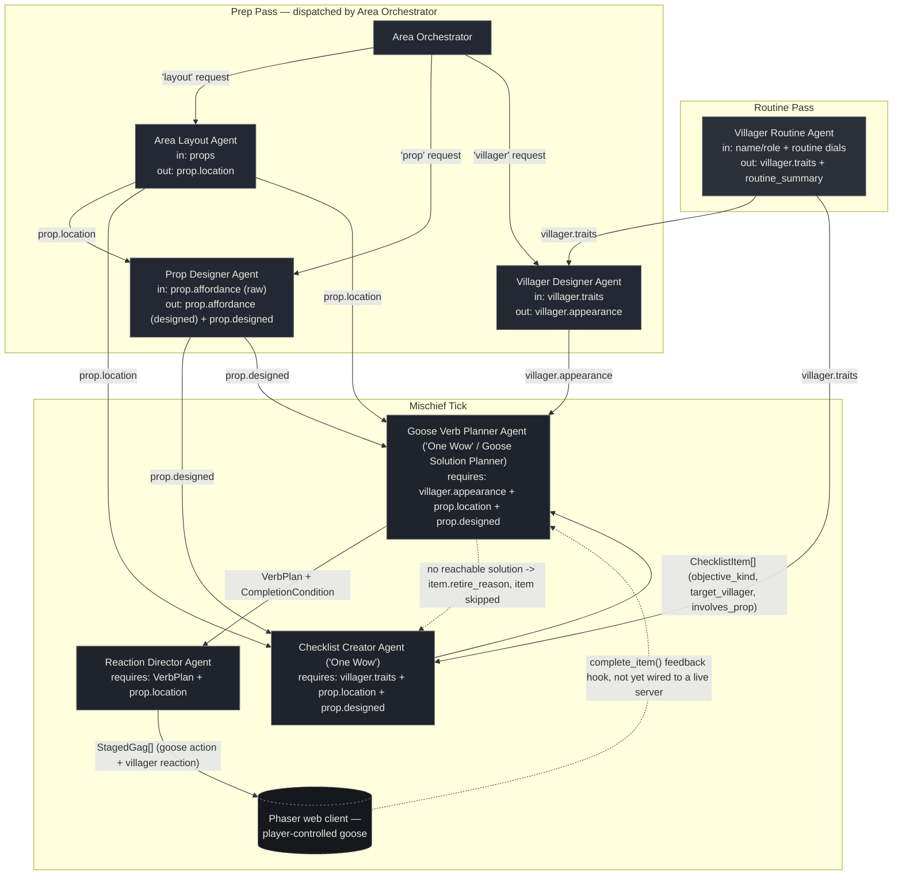

# Agent Diagram — Untitled Goose Game Village Mischief Crew

Three stages, run in order every time the crew executes: a **Routine
Pass** (one villager-behavior agent), a **Prep Pass** (dispatched by the
Area Orchestrator, once per villager/prop), and a **Mischief Tick**
(checklist → verb plan → staged gag, run every time the goose starts a
new objective). Every arrow below is a real field being read/written in
[`agents.py`](agents.py) / [`crew.py`](crew.py) — none are decorative.

## Why every agent is load-bearing

Each arrow is enforced in code, not just implied — remove the upstream
agent and the downstream one raises a `ValueError` instead of silently
producing worse output:

- **Villager Routine Agent** writes `villager.traits`. Both **Villager
  Designer Agent** and **Checklist Creator Agent** check for it and
  refuse to run without it.
- **Area Layout Agent** writes `prop.location`. **Checklist Creator**,
  **Goose Verb Planner**, and **Reaction Director** all check for it
  directly and refuse to run (or have nothing to stage) without it.
- **Prop Designer Agent** sets `prop.designed = True`. **Checklist
  Creator** and **Goose Verb Planner** both check it, so a skipped Prop
  Designer can't let the raw seed affordance text slip through as if it
  were finished content.
- **Villager Designer Agent** writes `villager.appearance`. **Goose Verb
  Planner** checks for it and refuses to run without it (it's quoted
  directly into the plan's stage direction).
- **Checklist Creator Agent** is one of this crew's two "One Wow" agents:
  no checklist, no verb plan, no staged gag — the mischief tick returns
  empty immediately.
- **Goose Verb Planner Agent** is the other "One Wow" agent, and doubles
  as the crew's Goose Solution Planner: it re-validates that the
  checklist item's villager/prop still exist and that the resolved
  prop's kind still matches the objective before staging anything, and
  **Reaction Director Agent** raises if it's ever handed a plan with no
  lines.
- **Area Orchestrator** is the single entry point the designer calls for
  new prep-time content — remove it and there's no dispatcher routing
  layout/prop/villager requests to the right sub-agent.

You can reproduce this: comment out the routine pass or the prep pass in
`main.py` and re-run — the crew stops with a clear `ValueError` naming
exactly which upstream agent was skipped, rather than continuing with
silently degraded output.

## Reading the diagram

- **Solid arrows** are direct hand-offs where one agent's output is a
  required input to the next.
- **Dotted arrows** are the two feedback paths: an unreachable checklist
  item retiring back onto the same checklist instead of reaching the
  player, and `UntitledGooseGameCrew.complete_item()` — a hook meant for
  a live game loop to call once a goal condition is actually confirmed
  satisfied, so the next mischief tick advances past a finished item.
  The current `web/` client only renders one static `output/run.json`
  snapshot, so that second feedback path is a designed hook, not yet a
  live one.
- **Phaser web client** is the player-visible terminus, not an agent —
  it reads the crew's JSON output (`output/run.json`) and renders the
  village, props, and the active checklist item's goose-verb plan.
