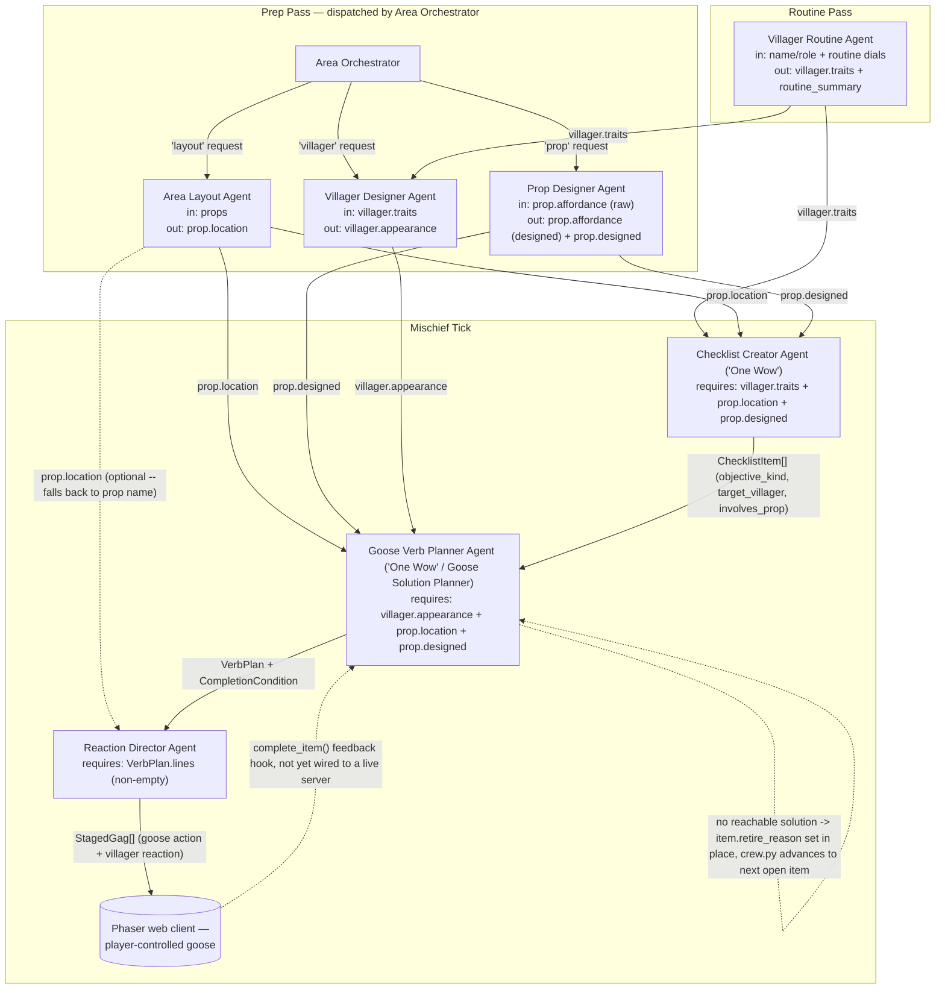

# Untitled Goose Game — Village Mischief Generation Crew

**Game:** *Untitled Goose Game* (House House, 2019) — built as a working
prototype of my capstone game's own AI Architecture. My capstone is
*Gachō Badi (Goose Buddy)* (GDD at `../README.md`), and its GDD leans
directly on Untitled Goose Game's own systems — the goose's five verbs,
indirect physical-comedy puzzles, and a checklist-driven objective loop.
This folder implements a crew built around *Untitled Goose Game itself*
rather than a re-skin of Gachō Badi's content or of this repo's other
reference crews, because UGG's systems (villager routines with **no
dialogue at all**, prop affordances, and a checklist of mischief
objectives) are public and well-documented enough to pressure-test the
"goose verbs solve everything, nothing is ever said aloud" side of the
architecture before writing Gachō Badi-specific prompts. See "Game
connection," below, for exactly how this crew's eight agents map onto
the capstone's own AI Architecture.

This is deliberately **not** shaped like Gachō Badi's 8-agent template
or this repo's other crews (see `../UnderTale_Multi_Agent`,
`../TomodachiLife_Multi_Agent`) — UGG has no personality-slider dialogue
system and no spoken lines whatsoever, so a Dialogue Writer Agent would
be inauthentic here. Instead, the roles below are built around what UGG
actually is: villager routines, prop affordances, village layout, a
mischief checklist, and a goose-verb planner that solves each checklist
item using only Honk / Grab / Run / Tug / Flap.

## Game connection — how this maps onto Gachō Badi

This isn't a generic multi-agent demo retrofitted with a game name — the
eight roles below are a direct architectural rehearsal of Gachō Badi's
own AI Architecture (see "AI Architecture" in `../README.md`), run
against Untitled Goose Game's public content instead of the capstone's
own residents/buildings/tasks, so the pipeline (and its validation) is
pressure-tested before it's pointed at Gachō Badi-specific prompts. One
role is even named identically on both sides:

| This crew (Untitled Goose Game) | Gachō Badi's AI Architecture equivalent | Shared generative pattern |
|---|---|---|
| Villager Routine Agent | Character Personality Agent | Turns numeric dials (here: territorialness/obliviousness/fussiness/patience; in the GDD: movement/speech/energy/intelligence) into named traits — same bucket-then-summarize pattern, re-labeled per game |
| Area Layout Agent | Island Layout Agent | Assigns each environment piece (prop / building) a location among a fixed set of named zones |
| Prop Designer Agent | Item Interaction / World Affordance Agent | Owns what a physical object actually affords the goose — the exact affordance graph the Gachō Badi GDD assigns to a dedicated "Planner-Critical" agent |
| Villager Designer Agent | Character Appearance Agent | Enriches a personality-bearing character with a design spec (outfit/loadout here; visual traits in the GDD) |
| Area Orchestrator | Scene Orchestrator | Dispatches a designer's content request to the right dev-time sub-agent instead of generating content itself |
| Checklist Creator Agent (**"One Wow"**) | Task Creator Agent (**"One Wow"**) | Proposes the central "thing to do" from the cast/props currently available, but does **not** certify it's solvable — that's the next agent's job in both architectures |
| **Goose Verb Planner Agent** (**"One Wow"**) | **Goose Solution Planner Agent** (**"One Wow", Primary Runtime Agent**) | Same name on both sides on purpose: proves a goose-verb-only solution actually exists against the current world model before an objective reaches the player, and retires/re-plans it otherwise |
| Reaction Director Agent | Director Agent | Converts the approved plan into the live, player-visible moment — object state change + character reaction — polling a goal condition rather than running a fixed cutscene |

So "goal-state-gated task generation" and "a Director that only plays a
reaction while its trigger condition holds" aren't just similar in
spirit between the two: `GooseVerbPlannerAgent.run()` and
`ReactionDirectorAgent.run()` in this repo are architecturally what
Gachō Badi's Goose Solution Planner and Director Agent need to do, just
fed Untitled Goose Game's villagers/props/verbs instead of Gachō Badi's
residents/buildings/relationships. Swapping in Gachō Badi's own seed
data and flavor text without touching the pipeline's structure or
validation is the intended next step once this architecture is
confirmed here.

## What this crew produces

Given a small village seed (a few villagers with routine dials, a few
props), one run of the crew produces:

- **Prep content** (dispatched by the `Area Orchestrator`):
  - a **village layout** placing every prop in one of six named zones
    (Garden, High Street, Back Gardens, Pub, Market, Manor)
  - a **prop design spec** per prop, calling out the physical affordance
    the goose can exploit (a rake that flings mud, a hat that blows off
    in a breeze, a key that hangs on a hook)
  - a **villager routine + outfit spec** per villager, derived from four
    routine dials (territorialness / obliviousness / fussiness /
    patience) — no dialogue, only the repeating loop of actions a player
    learns to read and disrupt
- **Mischief Tick output**, using that prepped state:
  - an open-ended **checklist of mischief objectives**, one per prop kind
    (wear-by-mistake, distract-and-swap, steal-from-area, lock-out-with-
    key, lure-into-hazard), each naming a specific villager and prop
  - a **goose-verb plan** for the active checklist item — a stage-
    direction-only sequence using just the five goose verbs, proven
    solvable against the current cast/props before it's shown
  - the **staged gag** — the actual gameplay: what the goose does and
    how the targeted villager reacts, physically, with no line of
    dialogue anywhere

Everything is printed to the terminal as it's produced and written as
structured JSON to `output/run.json`, which the included Phaser web
client (`web/`) reads directly to render a playable village scene.

## The eight agents — role, input, output

Each agent has exactly one job, and each one's output is a field another
agent requires — remove any single agent (skip `AreaLayoutAgent` before
`ChecklistCreatorAgent`, say) and the pipeline raises a clear
`ValueError` instead of degrading silently. The two marked **"One Wow"**
are this crew's highest-stakes agents: a bad checklist item or a
dialogue-shaped gag would immediately break UGG's premise for the player.

| Agent | Input | Output |
|---|---|---|
| Villager Routine Agent | a villager's name/role + routine dials (territorialness/obliviousness/fussiness/patience) | `villager.traits` + a no-dialogue routine summary |
| Area Layout Agent | list of props | `prop.location` (mutates in place), assigned across 6 village zones |
| Prop Designer Agent | a prop *(needs raw `.affordance` hint)* | `prop.affordance`, enriched, + `prop.designed = True` (mutates in place) |
| Villager Designer Agent | a villager *(needs `.traits`)* | `villager.appearance` — outfit + tell-tale carried prop (mutates in place) |
| Area Orchestrator | a request kind (`layout`/`prop`/`villager`) + payload | dispatches to the matching prep-time agent above, returns its result |
| Checklist Creator Agent (**"One Wow"**) | villagers *(need `.traits`)* + props *(need `.location` + `.designed`)* | `List[ChecklistItem]` — the open-ended mischief checklist |
| Goose Verb Planner Agent (**"One Wow"**, also this crew's Goose Solution Planner) | a checklist item + villagers *(need `.appearance`)* + props *(need `.location` + `.designed`)* | a `VerbPlan` (Honk/Grab/Run/Tug/Flap sequence + a structured, checkable `CompletionCondition`), or retires the item if no solution is reachable against the current cast |
| Reaction Director Agent | the `VerbPlan` *(needs non-empty `.lines`)* + the active checklist item + props *(reads `.location` if present, falls back to the prop's name otherwise)* | `List[StagedGag]` — the actual gameplay: goose action + villager reaction, no dialogue |

Implementation: [`agents.py`](agents.py) (agent definitions, with each
agent's required input validated at the top of its `run()`, and the
`OBJECTIVE_KINDS` table tying a prop kind to its checklist template,
verb sequence, and completion mechanic), [`models.py`](models.py)
(shared data passed between agents — deliberately has no dialogue-shaped
field anywhere), [`crew.py`](crew.py) (orchestration: one routine pass,
one prep pass, one mischief tick, in the order the dependencies above
require), [`main.py`](main.py) (entry point).

## Architecture diagram



Full breakdown of why every arrow is enforced in code (not just implied)
— including how to reproduce the failure by skipping an agent — lives in
[`DIAGRAM.md`](DIAGRAM.md).

### The Goose Verb Planner as Goose Solution Planner

The Checklist Creator does not certify that an objective is actually
solvable — it just picks a coherent pairing of villager, prop, and
objective kind. The **Goose Verb Planner Agent** is this crew's Goose
Solution Planner: before any item reaches the player, it re-checks that
the item's `target_villager` and `involves_prop` still name something in
the current cast, and that the resolved prop's kind still matches what
the objective kind requires. If either check fails, the item is retired
with a stated `retire_reason` instead of leaving the player chasing a
villager or prop that isn't there — `crew.py`'s `run_mischief_tick()`
walks the checklist and skips straight to the next open, reachable item.

## Working crew

`python3 main.py` runs all eight agents end-to-end — a routine pass, a
prep pass, and a mischief tick — and always finishes with valid output
written to `output/run.json`, with or without an API key: `llm_client.py`
catches any provider failure per-call and substitutes a deterministic
local fallback, and `main.py` wraps the whole run in a last-resort
try/except so a crew failure is reported, never a silent crash. A fresh
clone with no setup (`cd UntitledGooseGame_Multi_Agent && python3
main.py`) reproduces this — see "Running it," below.

## Why raw orchestration instead of the `crewai` package

The crew is plain Python with no third-party dependencies, structured
the way CrewAI structures a crew (each agent has a `role`/`goal`/
`backstory` and a single `run()` task; `UntitledGooseGameCrew` sequences
them and passes output forward as input). This guarantees the
assignment requirement — multiple agents coordinate and produce output
without crashing — holds on any machine with Python 3.9+, no package
install and no API key required.

Each agent calls out through [`llm_client.py`](llm_client.py), which
supports three providers, checked in this order unless `LLM_PROVIDER`
forces one:

1. **Anthropic (Claude)** — used if `ANTHROPIC_API_KEY` is set and
   `anthropic` is installed.
2. **OpenAI** — used if `OPENAI_API_KEY` is set and `openai` is
   installed (and Anthropic wasn't selected).
3. **mock** — a deterministic local generator built from the same
   structured inputs (routine dials, prop kind, checklist objective).
   Used whenever no provider is configured, *or* if a real call fails
   for any reason (no network, bad key, rate limit) — the failure is
   caught per-call and that one call falls back, the run continues.

So the same code path demonstrates real multi-agent LLM coordination on
whichever provider you have credentials for, and still runs to
completion and produces correct, inspectable output when you don't.

## Running it

```bash
cd UntitledGooseGame_Multi_Agent
python3 main.py
```

No setup required — this uses the local mock provider and writes
`output/run.json`.

### Running on Claude

```bash
pip install anthropic
export ANTHROPIC_API_KEY=...
python3 main.py
```

### Running on OpenAI

```bash
pip install openai
export OPENAI_API_KEY=...
python3 main.py
```

### Forcing a provider / model

If both keys happen to be set, Anthropic wins by default. Override with:

```bash
export LLM_PROVIDER=anthropic   # or: openai | mock
export ANTHROPIC_MODEL=claude-sonnet-5   # optional, this is the default
export OPENAI_MODEL=gpt-4o-mini          # optional, this is the default
```

`main.py`'s summary line reports which provider actually ran
(`LLM provider in use : anthropic (live API calls)`, etc.), so you can
confirm which one was used without reading the source.

Output lands in `output/run.json` and is also logged to the terminal as
each agent runs, so you can see the hand-off between agents in real time
(e.g. `[Checklist Creator Agent] generated 5 checklist item(s)`
immediately followed by `[Goose Verb Planner Agent] planned verb
sequence for item #1 (5 lines)`).

### Playing the result

```bash
cd web
python3 -m http.server
```

Then open `http://localhost:8000` — the Phaser client fetches
`../output/run.json` and renders the village, props, and the active
checklist item's goose-verb plan live. `index.html` also embeds a
fallback copy of `run.json` so the page still works if opened directly
as a `file://` URL (no server), though re-running `main.py` only updates
the live file, not that embedded fallback copy.
