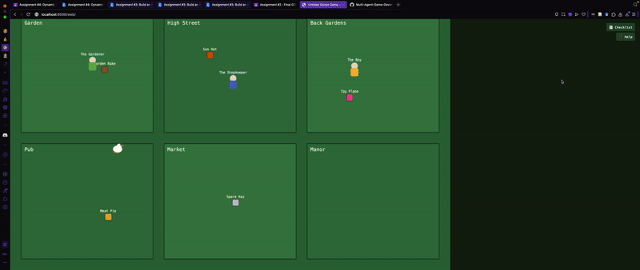
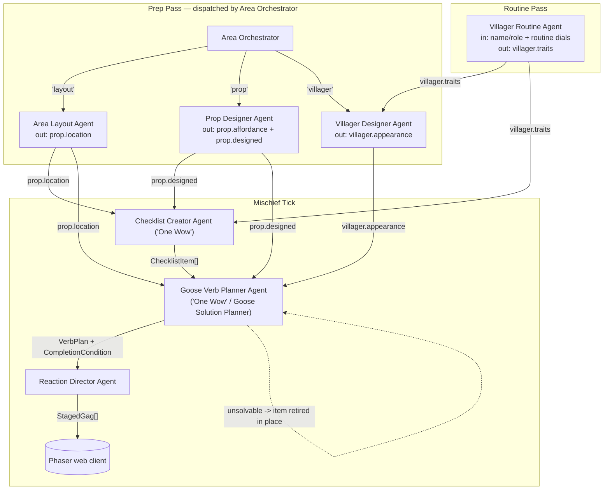

# Untitled Goose Game — Village Mischief Crew



**Game:** *Untitled Goose Game* (House House, 2019). This crew is a
working rehearsal of my capstone's own AI Architecture — my capstone is
*Gachō Badi (Goose Buddy)* (GDD at `../README.md`) — run against UGG's
public content (villager routines, prop affordances, a mischief
checklist, five goose verbs, **no dialogue**) instead of Gachō Badi's own
residents, so the pipeline gets pressure-tested before it's pointed at
capstone-specific content. (Full-resolution recording: [`Demo_v1.mov`](Demo_v1.mov).)

## What this crew produces

Given a small village seed (a few villagers with routine dials, a few
props), one run produces:

- **Prep content:** a village layout (props placed across 6 named
  zones), a physical affordance spec per prop, and a routine + outfit
  spec per villager — no dialogue anywhere, just the repeating loop of
  actions a player learns to read and disrupt.
- **A mischief checklist:** one open-ended objective per prop (e.g. "Get
  The Gardener to chase you into the Garden Rake's reach"), each tied to
  a specific villager and prop.
- **A goose-verb plan + staged gag** for the active checklist item: a
  stage-direction-only sequence using just Honk/Grab/Run/Tug/Flap,
  proven solvable before it's shown, plus the resulting villager
  reaction — the actual gameplay.

All of it is written to `output/run.json`. The Phaser client in `web/`
reads that file and plays it live — moving the goose, checking off
checklist items as their goal condition is met (see `Demo_v1.mov`).

## Game connection — how this maps onto Gachō Badi

Every role here has a named counterpart in Gachō Badi's AI Architecture
(`../README.md`) — one is even named identically on both sides:

| This crew (UGG) | Gachō Badi equivalent |
|---|---|
| Villager Routine Agent | Character Personality Agent |
| Area Layout Agent | Island Layout Agent |
| Prop Designer Agent | Item Interaction / World Affordance Agent |
| Villager Designer Agent | Character Appearance Agent |
| Area Orchestrator | Scene Orchestrator |
| Checklist Creator Agent ("One Wow") | Task Creator Agent ("One Wow") |
| **Goose Verb Planner Agent** ("One Wow") | **Goose Solution Planner Agent** ("One Wow") |
| Reaction Director Agent | Director Agent |

Swapping in Gachō Badi's own residents/buildings/tasks without touching
the pipeline's structure or validation is the intended next step once
this architecture is confirmed here.

## The eight agents — role, input, output

Each agent has one job, and each output is a field the next agent
requires — skip one and the pipeline raises a named `ValueError` instead
of degrading silently (verified by running it with a step skipped; full
proof in [`DIAGRAM.md`](DIAGRAM.md)).

| Agent | Input | Output |
|---|---|---|
| Villager Routine Agent | name/role + routine dials | `villager.traits` + routine summary |
| Area Layout Agent | props | `prop.location` |
| Prop Designer Agent | a prop (raw affordance hint) | `prop.affordance` + `prop.designed` |
| Villager Designer Agent | a villager (needs `.traits`) | `villager.appearance` |
| Area Orchestrator | request kind + payload | dispatches to the matching agent above |
| Checklist Creator Agent ("One Wow") | villagers (`.traits`) + props (`.location`, `.designed`) | `List[ChecklistItem]` |
| Goose Verb Planner Agent ("One Wow" / Goose Solution Planner) | a checklist item + villagers (`.appearance`) + props | `VerbPlan` + `CompletionCondition`, or retires the item if unsolvable |
| Reaction Director Agent | the `VerbPlan` + item + props | `List[StagedGag]` — the player-visible gameplay |

Implementation: [`agents.py`](agents.py) (roles + validation),
[`models.py`](models.py) (shared data, deliberately no dialogue field),
[`crew.py`](crew.py) (orchestration), [`main.py`](main.py) (entry point).

## Architecture diagram



Full breakdown of every arrow (including the ones that are soft/optional
rather than required) and how to reproduce a skipped-agent failure lives
in [`DIAGRAM.md`](DIAGRAM.md).

## Running it

```bash
cd UntitledGooseGame_Multi_Agent
python3 main.py          # runs all 8 agents, writes output/run.json
cd web && python3 -m http.server   # then open http://localhost:8000 to play it
```

No API key needed — agents fall back to a deterministic local generator
(`llm_client.py`) when no `ANTHROPIC_API_KEY`/`OPENAI_API_KEY` is set, or
if a live call fails. Set one of those (and `pip install anthropic` /
`openai`) to have agents call a real model instead; `main.py`'s summary
line reports which provider actually ran.
